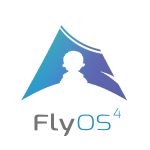

<<<<<<< HEAD
    
   <strong>飞屎OS-bate4 is an artifact of Android phones</strong>
=======
    
   <strong>FlyOS4 is an artifact of Android phones</strong>
>>>>>>> parent of aeeb25f (✨ feat(震撼发布): Fly OS -> 惊喜不只是飞)

<!DOCTYPE html>
<html>
 <head> 
   <h2>Document Language</h2>
<<<<<<< HEAD
   <a href="http://飞屎OS-bategeek.com/cn.html">简体中文</a>
   
  <a href="http://飞屎OS-bategeek.com/ru.html">русский</a>
   
 
    <h2>Introduction</h2> 
    
飞屎OS-bate is an artifact of Android phones, the baby of geeks
 
    
The original and complete Linux system  

    
飞屎OS-bate Console:(Main function)
 
=======
   <a href="http://flyosgeek.com/cn.html">简体中文</a>
   
  <a href="http://flyosgeek.com/ru.html">русский</a>
   
 
    <h2>Introduction</h2> 
    
FlyOS is an artifact of Android phones, the baby of geeks
 
    
The original and complete Linux system  

    
FlyOS Console:(Main function)
 
>>>>>>> parent of aeeb25f (✨ feat(震撼发布): Fly OS -> 惊喜不只是飞)
    <ul> 
     <li>Web panel (one-click mobile station construction)</li> 
     <li>Web deployment of the original GNU/Linux distribution&lt; /li&gt; </li>
     <li>Online web-friendly creation of virtual machine panel</li> 
     <li>Support Beginner one-click deployment of various systems</li> 
     <li>Use FlyChat to chat</li> 
     <li>Use web to manage mobile phone online Function, remote control</li> 
<<<<<<< HEAD
     <li>You can use 飞屎OS-batex86wine or a virtual machine to run Windows (EXE, MSI) applications</li> 
=======
     <li>You can use flyosx86wine or a virtual machine to run Windows (EXE, MSI) applications</li> 
>>>>>>> parent of aeeb25f (✨ feat(震撼发布): Fly OS -> 惊喜不只是飞)
     <li>One-click installation of software packages</li> 
     <li>Develop artificial intelligence projects&lt; /li&gt; </li>
     <li>Deploying GUI environment</li> 
     <li>Network security test</li> 
    </ul> 
   
 
   
 
    <h2>Installation</h2> 
    <ol> 
     <li>Install <a href="http://f-droid.org/en/packages/com.termux/">termux</a> and open</li> 
<<<<<<< HEAD
     <li>Enter in Termux: <kbd>curl -L http://飞屎OS-bategeek.com/gosetup.sh | bash</kbd> and press Enter</li> 
    </ol> 
   
 
   
 
    <h2>Quick start</h2> 
飞屎OS-bate runs in the termux advanced terminal, easy to use, so you don’t need much configuration
 
After the installation is complete, enter exit, open it again, we will initialize, and the browser will visit the corresponding display address The configuration can be completed. After the configuration is successful, 飞屎OS-bate will start automatically. After the configuration is complete, it is simple and easy to use, and can understand a little level (development for junior high school students, I believe your level is not bad)
 </h2>
=======
     <li>Enter in Termux: <kbd>curl -L http://flyosgeek.com/gosetup.sh | bash</kbd> and press Enter</li> 
    </ol> 
   
 
   
 
    <h2>Quick start</h2> 
flyos runs in the termux advanced terminal, easy to use, so you don’t need much configuration
 
After the installation is complete, enter exit, open it again, we will initialize, and the browser will visit the corresponding display address The configuration can be completed. After the configuration is successful, flyos will start automatically. After the configuration is complete, it is simple and easy to use, and can understand a little level (development for junior high school students, I believe your level is not bad)
 </h2>
>>>>>>> parent of aeeb25f (✨ feat(震撼发布): Fly OS -> 惊喜不只是飞)
   
 
   
 
    
 
    
 
    
 
<<<<<<< HEAD
     <h2> Is 飞屎OS-bate a system? Why is there an os? </h2> 
     
Some people say that 飞屎OS-bate is not os, but 飞屎OS-bate can be said to be one of termux's linux distributions (referring to the rootfs transformation under data), so it is os. 飞屎OS-bate is not like other scripts, but single The file, there is no dependency. And it is mentioned in the chapter on the origin of 飞屎OS-bate that 飞屎OS-bate was originally a rom, so we did not change the name, but it is also an os now. 
 
    
 
   
 
  
    
Telegram exchange group: t.me/飞屎OS-batepro(@飞屎OS-batepro)
 
=======
     <h2> Is FlyOS a system? Why is there an os? </h2> 
     
Some people say that FlyOS is not os, but FlyOS can be said to be one of termux's linux distributions (referring to the rootfs transformation under data), so it is os. FlyOS is not like other scripts, but single The file, there is no dependency. And it is mentioned in the chapter on the origin of flyos that FlyOS was originally a rom, so we did not change the name, but it is also an os now. 
 
    
 
   
 
  
    
Telegram exchange group: t.me/flyospro(@flyospro)
 
>>>>>>> parent of aeeb25f (✨ feat(震撼发布): Fly OS -> 惊喜不只是飞)
   
 
   
 
    <h2>Donate</h2> 
    Paypal:xingyujie50
   
 
   
 
    <h2>screenshots</h2> 
<<<<<<< HEAD
     
     
     
     
=======
     
     
     
     
>>>>>>> parent of aeeb25f (✨ feat(震撼发布): Fly OS -> 惊喜不只是飞)
   
 
  Open Source Project Reference License
  
 Django- Django Software Foundation
 Pywebio -Mit License
 win10-ui -Mit License

  

 </body>
</html>
