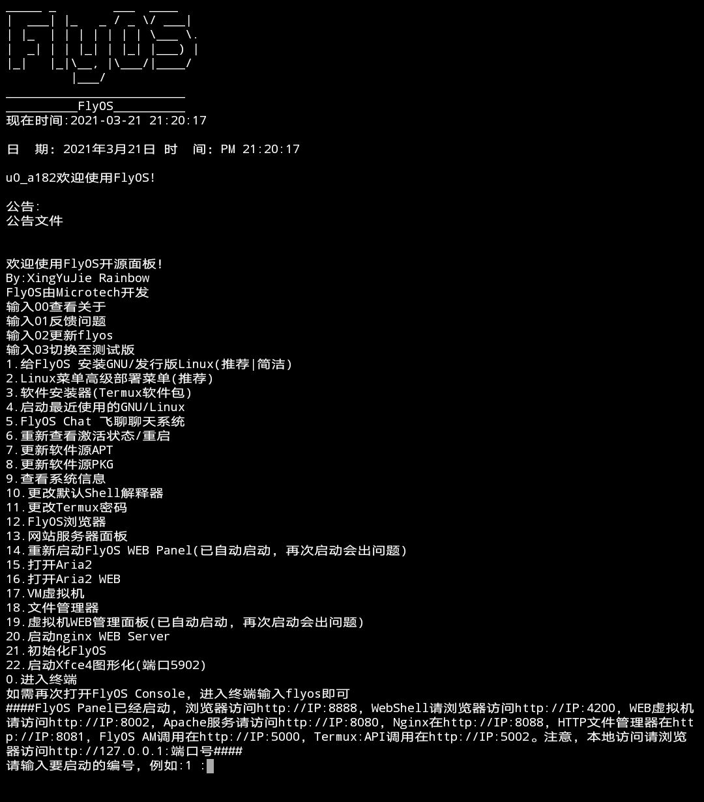
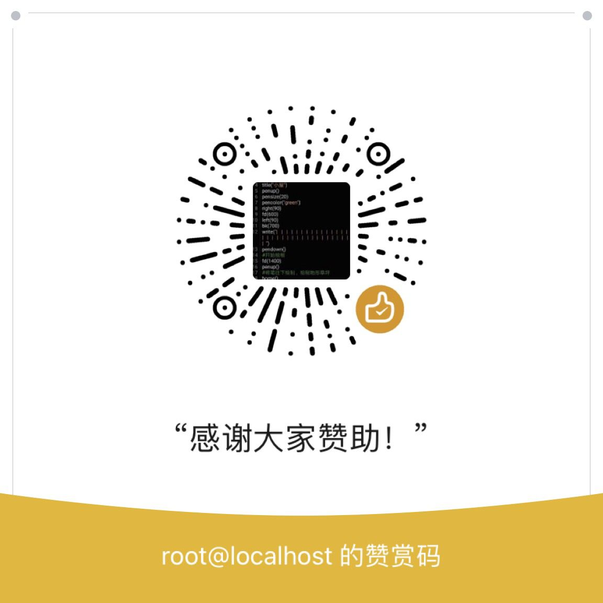

# 介绍
FlyOS是安卓手机的一款神器，极客的宝贝
原汁原味的完整Linux系统
FlyOS Console:(主功能)
Web面板(一键手机建站)，部署原汁原味的GNU/Linux发行版，部署Android,Windows虚拟机，使用FlyChat聊天，可以使用web在线管理手机的功能，远程遥控，可以流畅跑Windows(EXE,MSI)应用程序，一键安装软件包，开发FlyOS(.fpk)程序，开发人工智能项目，部署GUI环境，网络安全测试...........
还有几十种功能，等你安装发现!  
*部分功能尚未开发完毕*  
# 安装
1.下载[termux](http://f-droid.org/en/packages/com.termux/)安装并打开  
2.在Termux中输入:curl http://flyosgeek.com/gosetup.sh | bash 并回车  
3.开始安装
# 关于
开发者:邢宇杰(XingYuJie) 和很多无私的奉献着。刚上初中的初中生一枚，计算机爱好者（幼儿园中班开始玩winxp），感谢广大开发者对flyos的支持！！！
软件通过GPL-V3.0协议发布，请遵守此协议
软件受地区法律保护
# 快速上手
为什么有flyos？可以参考flyos的由来章节  
flyos在termux高级终端中运行，简单易用，因此您无需太多配置  
安装完成后输入exit，再次打开我们会进行初始化，浏览器访问相应显示地址即可完成配置，配置成功后，flyos将会自启动。  
寻求帮助？可以去更多章节加入qq或者telegram讨论组。
# flyos的由来
作者本人上小学的时候父母不让我用电脑，因此对计算机学习产生了很大的阻碍，并产生疑问能否在手机运行pc系统，达到无需电脑使用桌面程序？今天他来了，flyos就是多年来的研究成果。flyos最早是rom包，但由于很多问题，转向了termux的使用。关于作者，请看关于章节。
# flyos到底是不是系统？为啥有个os？
flyos有人说并非os，但flyos可以说是termux的linux发行版之一（指data下面的rootfs改造），所以他是os，flyos并不像其他的脚本一样，只是单一的文件，没有依赖。并且在flyos的由来章节中提到，flyos最早是rom，所以我们并没有改变这个名字，但他现在本身也是os。
# 更多
QQ交流群:[440406148（貌似已满，点进去后引导加二群）](https://jq.qq.com/?_wv=1027&k=Gd5z9j7v)  
Telegram交流群:t.me/flyospro(@flyospro)
# 截图
  
# 捐献

# 吐个槽
[点我反馈吐槽](https://support.qq.com/product/323431)
