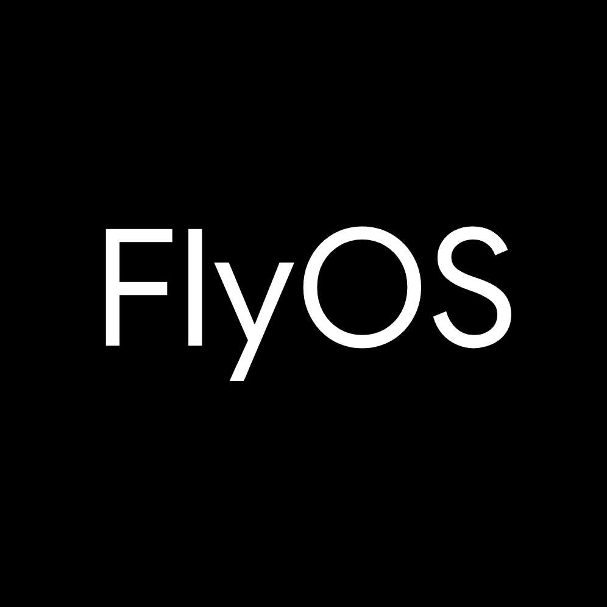
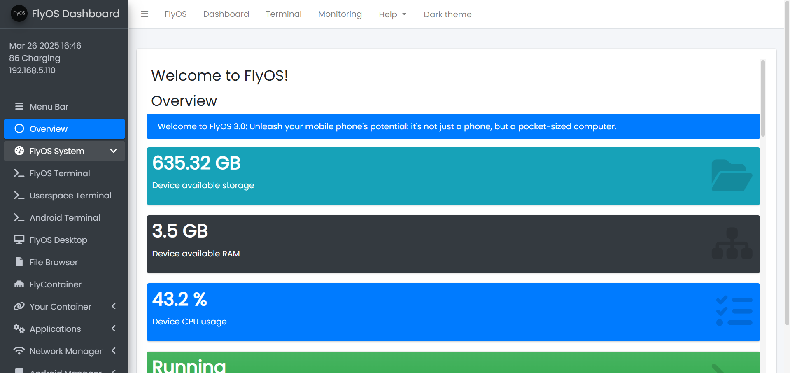

# The FlyOS Project
---

  

## Preview Screenshots Under Development

  
  
  
  
  
  

  
  

  

(*) These screenshots represent the current development stage and may not reflect the final product. We are continuously enhancing the functionalities. 

This repository contains essential files and source code, excluding third-party code and binary applications.

## FlyOS 3.0 is Under Development! Stay Tuned!

### The FlyOS Project by DigitalPlat.org

---

# Introduction

Unleash your mobile phone's potential: it's not just a phone, but a pocket-sized computer.

Experience the power of mobile computing with FlyOS. Access your FlyOS Linux subsystem on any computer, just with a web browser. No extra software required. Enjoy a full Ubuntu-based Linux subsystem with your preferences, data, files, and applications. It's all yours.

Unlock the possibilities of mobile productivity. Imagine coding on your phone, connecting a keyboard and mouse, and effortlessly accessing your favorite tools like LibreOffice, VSCode, GIMP, Jupyter, and more. It's a complete Linux system that fits in your pocket! Wherever you go, your data is always within reach. Experience the freedom of seamless access, empowering you to create and work anywhere, anytime.

#### Note: Since FlyOS is still under development, we will release a more comprehensive introduction and documentation in the future, so stay tuned!

# Donate

Donate this project author Edward Hsing, 100% to Edward Hsing, PayPal: [PayPal Donation](https://www.paypal.com/paypalme/xingyujieph/)

Donate to our foundation DigitalPlat, a 501(c)(3) fiscally sponsored organization (EIN: 81-2908499), (Support non-profit open source projects):

- [Donate via Hack Club Bank](https://bank.hackclub.com/donations/start/digitalplat)
- [DigitalPlat Homepage](https://digitalplat.org)

  

